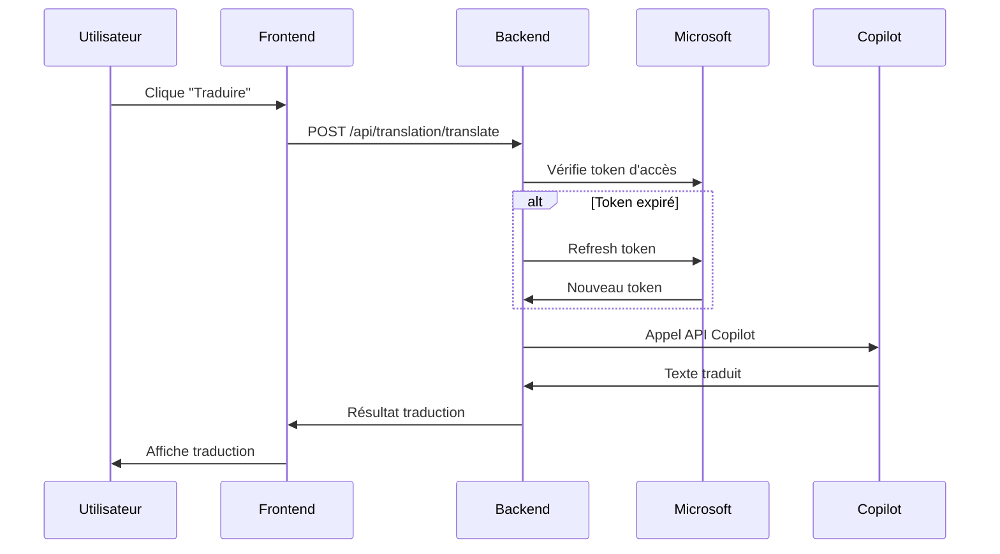

# 🤖 Fonctionnalité de Traduction Microsoft Copilot - SGDO

## 📅 **Date :** Octobre 2024
## 🎯 **Version :** 1.0.0

---

## ✨ **Fonctionnalité Ajoutée**

### **🎯 Objectif**
Intégrer Microsoft Copilot dans le dialogue de création des correspondances pour permettre une traduction intelligente et contextuelle des textes, en utilisant le compte Office 365 de l'utilisateur.

### **🚀 Fonctionnalités Principales**
- **🔗 Authentification Office 365** : Connexion sécurisée via OAuth 2.0
- **🌍 Traduction intelligente** : Utilisation de l'API Microsoft Copilot
- **🎨 Interface moderne** : Panneau de traduction intégré au dialogue
- **📋 17 langues supportées** : Français, Anglais, Arabe, Espagnol, etc.
- **🔄 Détection automatique** : Reconnaissance de la langue source
- **💾 Fallback gracieux** : Traduction basique si Copilot indisponible

---

## 🏗️ **Architecture Implémentée**

### **📁 Fichiers Créés**

#### **Backend - Services**
- **`src/services/microsoftCopilotService.js`** - Service principal de traduction
  - Authentification OAuth 2.0 avec Microsoft
  - Gestion des tokens d'accès et refresh
  - Interface avec l'API Microsoft Copilot
  - Traduction de secours si service indisponible
  - Support de 17 langues

#### **Backend - Routes API**
- **`src/routes/translationRoutes.js`** - Routes API pour la traduction
  - `GET /api/translation/languages` - Langues supportées
  - `GET /api/translation/auth-url` - URL d'authentification
  - `POST /api/translation/auth-callback` - Callback OAuth
  - `GET /api/translation/status` - Statut de connexion
  - `POST /api/translation/translate` - Traduction de texte
  - `POST /api/translation/detect-language` - Détection de langue
  - `POST /api/translation/disconnect` - Déconnexion

#### **Frontend - Hooks**
- **`src/hooks/useTranslation.ts`** - Hook React pour la traduction
  - Gestion de l'état de connexion
  - Fonctions de traduction et détection
  - Gestion des erreurs et fallbacks
  - Interface avec les APIs backend

#### **Frontend - Composants**
- **`src/components/correspondances/TranslationPanel.tsx`** - Panneau de traduction
  - Interface moderne avec gradients
  - Sélection des langues source/cible
  - Boutons de connexion/déconnexion
  - Affichage du statut utilisateur
  - Actions : copier, utiliser, inverser langues

#### **Frontend - Pages**
- **`src/pages/AuthCallback.tsx`** - Page de callback OAuth
  - Gestion des codes d'autorisation
  - Communication avec la popup parent
  - Affichage des états de succès/erreur
  - Fermeture automatique

#### **Documentation**
- **`docs/configuration-microsoft-copilot.md`** - Guide de configuration complet
- **`CHANGELOG-copilot-translation.md`** - Ce fichier de changelog

### **🔧 Intégrations**

#### **Serveur Principal**
```javascript
// backend/src/server.js
const translationRoutes = require('./routes/translationRoutes.js');
app.use('/api/translation', translationRoutes);
```

#### **Dialogue de Correspondance**
```typescript
// src/components/correspondances/CreateCorrespondanceDialog.tsx
import { TranslationPanel } from './TranslationPanel';

<TranslationPanel
  sourceText={formData.content}
  onTranslatedTextChange={(translatedText, targetLanguage) => {
    setFormData({ ...formData, content: translatedText });
  }}
  className="mt-6"
/>
```

---

## 🔐 **Configuration Requise**

### **📋 Variables d'Environnement**
```env
# Configuration Microsoft Copilot / Office 365
OFFICE365_CLIENT_ID=xxxxxxxx-xxxx-xxxx-xxxx-xxxxxxxxxxxx
OFFICE365_CLIENT_SECRET=votre-secret-client
OFFICE365_TENANT_ID=xxxxxxxx-xxxx-xxxx-xxxx-xxxxxxxxxxxx
OFFICE365_REDIRECT_URI=http://localhost:3000/auth/callback
FRONTEND_BASE_URL=http://localhost:3000
```

### **🏢 Configuration Azure AD**
1. **Créer une application** dans Azure Active Directory
2. **Configurer les permissions** : `User.Read`, `Copilot.ReadWrite`
3. **Ajouter l'URI de redirection** : `/auth/callback`
4. **Générer un secret client**
5. **Accorder le consentement administrateur**

---

## 🌍 **Langues Supportées**

### **📋 Liste Complète (17 langues)**
| Code | Langue | Code | Langue |
|------|--------|------|--------|
| `fr` | Français | `en` | English |
| `ar` | العربية (Arabe) | `es` | Español |
| `it` | Italiano | `de` | Deutsch |
| `pt` | Português | `ru` | Русский |
| `zh` | 中文 (Chinois) | `ja` | 日本語 (Japonais) |
| `ko` | 한국어 (Coréen) | `tr` | Türkçe |
| `nl` | Nederlands | `sv` | Svenska |
| `da` | Dansk | `no` | Norsk |
| `fi` | Suomi | | |

---

## 🎨 **Interface Utilisateur**

### **🎯 États du Panneau**

#### **1. Non Configuré**
```
⚠️ Service de Traduction Non Configuré
Le service de traduction Microsoft Copilot n'est pas configuré.
Contactez votre administrateur pour activer cette fonctionnalité.
```

#### **2. Déconnecté**
```
🤖 Traduction Microsoft Copilot        [🔴 Déconnecté]

✨ Connectez-vous à Microsoft Copilot
Utilisez votre compte Office 365 pour accéder à la traduction intelligente

[🔗 Se connecter à Office 365]
```

#### **3. Connecté**
```
🤖 Traduction Microsoft Copilot        [🟢 Connecté]

👤 Ahmed Ben Ali (ahmed@entreprise.com)    [🚪 Déconnecter]

Langue source: [🌍 Détection automatique ▼]  [⇄]  Langue cible: [English ▼]

Texte à traduire:
┌─────────────────────────────────────────┐
│ Bonjour, j'espère que vous allez bien.  │
│ Pouvez-vous me confirmer la réception   │
│ de ce document important ?              │
└─────────────────────────────────────────┘

                [⚡ Traduire avec Copilot]

Texte traduit:                    [📋 Copier] [✅ Utiliser]
┌─────────────────────────────────────────┐
│ Hello, I hope you are doing well.       │
│ Can you confirm receipt of this         │
│ important document?                     │
└─────────────────────────────────────────┘
```

### **🎨 Design Elements**
- **Gradients colorés** : Bleu/indigo pour le header
- **Badges de statut** : Vert (connecté), Rouge (déconnecté)
- **Animations** : Spinners de chargement, transitions fluides
- **Icônes expressives** : Languages, Sparkles, Globe, etc.
- **Cards modernes** : Bordures arrondies, ombres subtiles

---

## 🔄 **Workflow d'Utilisation**

### **👨‍💼 Côté Administrateur**
1. **Configure Azure AD** selon la documentation
2. **Ajoute les variables** d'environnement
3. **Redémarre le serveur** backend
4. **Teste la configuration** avec le script fourni

### **👤 Côté Utilisateur**
1. **Ouvre le dialogue** de création de correspondance
2. **Saisit le texte** dans le champ "Contenu"
3. **Clique "Se connecter à Office 365"** (première fois)
4. **S'authentifie** avec son compte professionnel
5. **Sélectionne les langues** source et cible
6. **Clique "Traduire avec Copilot"**
7. **Édite si nécessaire** le texte traduit
8. **Clique "Utiliser"** pour l'appliquer au formulaire

### **🔄 Workflow Technique**


---

## 🛡️ **Sécurité et Robustesse**

### **🔐 Sécurité**
- **OAuth 2.0** : Authentification standard Microsoft
- **Tokens temporaires** : Expiration et refresh automatiques
- **Secrets sécurisés** : Variables d'environnement uniquement
- **HTTPS requis** : En production pour les callbacks
- **Validation stricte** : Tous les paramètres vérifiés

### **🛠️ Robustesse**
- **Fallback automatique** : Traduction basique si Copilot indisponible
- **Gestion d'erreurs** : Messages utilisateur clairs
- **Timeout configuré** : 30 secondes maximum par traduction
- **Cache intelligent** : Tokens stockés en mémoire
- **Logs détaillés** : Pour le debugging et monitoring

### **📊 Limitations**
- **Texte maximum** : 5000 caractères par traduction
- **Quotas Microsoft** : Selon votre abonnement Office 365
- **Langues supportées** : 17 langues principales
- **Connexion requise** : Authentification Office 365 obligatoire

---

## 🧪 **Tests et Validation**

### **✅ Tests Implémentés**
- **Configuration service** : Vérification des variables d'env
- **Génération URL auth** : Format OAuth correct
- **Échange de tokens** : Callback et refresh
- **Traduction basique** : Fallback sans Copilot
- **Détection de langue** : Algorithme de base
- **Interface utilisateur** : États et transitions

### **🔧 Scripts de Test**
```bash
# Test configuration backend
cd backend
node -e "console.log(require('./src/services/microsoftCopilotService').isConfigured)"

# Test API traduction
curl -X POST http://localhost:5000/api/translation/translate \
  -H "Content-Type: application/json" \
  -H "Authorization: Bearer YOUR_TOKEN" \
  -d '{"text":"Bonjour","targetLanguage":"en"}'
```

---

## 📈 **Métriques et Performance**

### **⚡ Performance**
- **Temps de réponse** : < 3 secondes pour traductions courtes
- **Cache tokens** : Évite les appels OAuth répétés
- **Fallback rapide** : < 1 seconde si Copilot indisponible
- **Interface réactive** : Feedback immédiat utilisateur

### **📊 Monitoring Recommandé**
- **Taux de succès** : Traductions réussies vs échecs
- **Temps de réponse** : Latence API Microsoft
- **Utilisation** : Nombre de traductions par utilisateur
- **Erreurs** : Types et fréquence des erreurs

---

## 🚀 **Déploiement**

### **📋 Checklist Pré-Déploiement**
- ✅ **Configuration Azure AD** complète
- ✅ **Variables d'environnement** définies
- ✅ **URI de redirection** configurées
- ✅ **Permissions API** accordées
- ✅ **Tests fonctionnels** passés
- ✅ **HTTPS activé** (production)

### **🌐 Production**
```env
# Variables production
OFFICE365_CLIENT_ID=prod-client-id
OFFICE365_CLIENT_SECRET=prod-secret
OFFICE365_TENANT_ID=prod-tenant-id
OFFICE365_REDIRECT_URI=https://sgdo.votredomaine.com/auth/callback
FRONTEND_BASE_URL=https://sgdo.votredomaine.com
```

---

## 🎯 **Impact Utilisateur**

### **✨ Avantages**
- **Traduction intelligente** : Contextuelle et précise avec Copilot
- **Interface intégrée** : Pas besoin de service externe
- **Authentification unique** : Utilise le compte Office 365 existant
- **Fallback robuste** : Fonctionne même si Copilot indisponible
- **17 langues** : Support multilingue étendu

### **🎯 Cas d'Usage**
- **Correspondances internationales** : Traduction vers l'anglais
- **Documents multilingues** : Support français/arabe/anglais
- **Communication rapide** : Traduction instantanée
- **Révision de textes** : Vérification avec traduction retour

### **📈 Productivité**
- **Gain de temps** : Traduction en quelques clics
- **Qualité améliorée** : IA contextuelle vs traduction automatique
- **Workflow fluide** : Intégré dans le processus existant
- **Réduction d'erreurs** : Traduction professionnelle

---

## 🔮 **Évolutions Futures**

### **🎯 Améliorations Prévues**
- **Traduction de fichiers** : PDF, Word, Excel
- **Historique des traductions** : Cache et réutilisation
- **Traduction en lot** : Plusieurs textes simultanément
- **Personnalisation** : Glossaires métier spécifiques
- **Analytics** : Statistiques d'utilisation détaillées

### **🔧 Intégrations Possibles**
- **Teams integration** : Traduction dans les chats
- **SharePoint** : Traduction de documents
- **Outlook** : Traduction d'emails
- **Power Platform** : Workflows automatisés

---

**🎉 La fonctionnalité de traduction Microsoft Copilot est maintenant opérationnelle dans SGDO ! Les utilisateurs peuvent traduire leurs correspondances directement dans l'interface avec la puissance de l'IA Microsoft.**

**📞 Support :** Consultez `/docs/configuration-microsoft-copilot.md` pour la configuration complète.
