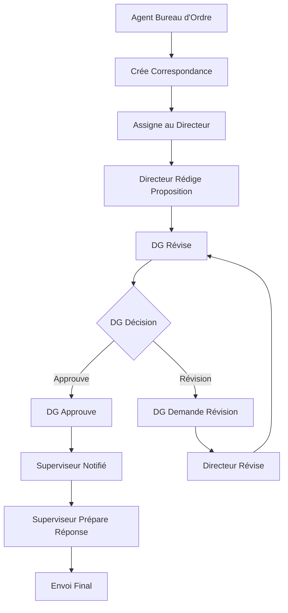

# 🔄 Guide Complet - Workflow de Correspondance avec Tous les Acteurs

## 🎯 Processus Complet Implémenté

### **Workflow Amélioré : Bureau d'Ordre → Directeur → DG → Superviseur → Envoi**



## 👥 Acteurs et Rôles

### **1. Agent Bureau d'Ordre**
- ✅ **Crée** la correspondance dans le système
- ✅ **Remplit** le formulaire de création complet
- ✅ **Assigne** au directeur/sous-directeur concerné
- ✅ **Sélectionne** le Directeur Général
- ✅ **Définit** la priorité du traitement

### **2. Directeur/Sous-Directeur Assigné**
- ✅ **Reçoit** la correspondance assignée
- ✅ **Rédige** la proposition de réponse
- ✅ **Joint** des pièces jointes si nécessaire
- ✅ **Révise** selon les feedbacks du DG
- ✅ **Participe** au système de chat avec le DG

### **3. Directeur Général**
- ✅ **Révise** les propositions de réponse
- ✅ **Donne feedback** détaillé via chat
- ✅ **Demande révisions** si nécessaire
- ✅ **Approuve** la version finale
- ✅ **Communique** directement avec le directeur

### **4. Superviseur Bureau d'Ordre**
- ✅ **Reçoit notification** d'approbation DG
- ✅ **Prépare** la réponse finale formatée
- ✅ **Ajoute** en-têtes et signatures officielles
- ✅ **Envoie** la réponse finale

## 🏗️ Architecture Technique Améliorée

### **Backend - Modèle de Données Enhanced**

#### **États du Workflow**
```javascript
CREATED → ASSIGNED_TO_DIRECTOR → DIRECTOR_DRAFT → DG_REVIEW → 
DG_FEEDBACK → DIRECTOR_REVISION → DG_APPROVED → 
SUPERVISOR_NOTIFIED → RESPONSE_PREPARED → RESPONSE_SENT
```

#### **Acteurs Trackés**
- `bureauOrdreAgent` - Agent qui crée la correspondance
- `superviseurBureauOrdre` - Superviseur pour la finalisation
- `assignedDirector` - Directeur/sous-directeur responsable
- `directeurGeneral` - DG pour approbation

#### **Système de Chat Intégré**
- Messages entre DG et Directeur
- Attachements dans les messages
- Versioning des propositions
- Historique complet des échanges

#### **Versioning des Propositions**
- Multiples versions trackées
- Feedback DG sur chaque version
- Statuts : `DRAFT`, `UNDER_REVIEW`, `NEEDS_REVISION`, `APPROVED`

### **Frontend - Interface Complète**

#### **Composants Principaux**
- `EnhancedCreateWorkflowDialog` - Création par bureau d'ordre
- `EnhancedWorkflowManager` - Gestion complète du workflow
- `EnhancedWorkflowPage` - Page dédiée avec progression

#### **Fonctionnalités UI**
- **Barre de progression** visuelle du workflow
- **Chat intégré** DG ↔ Directeur
- **Versioning** des propositions
- **Upload de fichiers** à chaque étape
- **Notifications** contextuelles

## 📊 API Endpoints Complets

### **1. Création par Bureau d'Ordre**
```http
POST /api/enhanced-workflow/create-by-bureau-ordre
{
  "correspondenceId": "...",
  "assignedDirectorId": "...",
  "directeurGeneralId": "...",
  "superviseurBureauOrdreId": "...",
  "priority": "HIGH"
}
```

### **2. Proposition par Directeur**
```http
POST /api/enhanced-workflow/:id/director-submit-draft
Content-Type: multipart/form-data
- draftContent: "Proposition de réponse..."
- comment: "Commentaire optionnel"
- attachments: [files]
```

### **3. Feedback DG**
```http
POST /api/enhanced-workflow/:id/dg-feedback
{
  "feedback": "Commentaires détaillés...",
  "action": "approve|request_revision",
  "draftVersion": 1
}
```

### **4. Révision Directeur**
```http
POST /api/enhanced-workflow/:id/director-revise
Content-Type: multipart/form-data
- revisedContent: "Proposition révisée..."
- responseToFeedback: "Réponse au feedback"
- attachments: [files]
```

### **5. Chat DG ↔ Directeur**
```http
GET /api/enhanced-workflow/:id/chat
POST /api/enhanced-workflow/:id/chat/send
```

### **6. Préparation par Superviseur**
```http
POST /api/enhanced-workflow/:id/supervisor-prepare-response
Content-Type: multipart/form-data
- finalResponseContent: "Réponse finale formatée..."
- comment: "Commentaire"
- attachments: [files]
```

### **7. Envoi Final**
```http
POST /api/enhanced-workflow/:id/send-final-response
{
  "comment": "Réponse envoyée par email et courrier"
}
```

## 🧪 Tests Complets

### **Test Automatisé Backend**
```bash
# Script de test complet
node test-enhanced-workflow.js

# Teste tous les scénarios :
✅ Création par bureau d'ordre
✅ Assignation au directeur
✅ Proposition de réponse
✅ Feedback et révisions DG
✅ Va-et-vient multiples
✅ Approbation finale
✅ Préparation par superviseur
✅ Envoi de la réponse
```

### **Test Frontend Manuel**

#### **Étape 1 : Création par Bureau d'Ordre**
1. **Se connecter** en tant qu'agent bureau d'ordre
2. **Aller** sur `/correspondances`
3. **Créer** une nouvelle correspondance
4. **Cliquer** sur l'icône Workflow (violet) 
5. **Sélectionner** :
   - Directeur/sous-directeur responsable
   - Directeur Général
   - Superviseur bureau d'ordre (optionnel)
   - Priorité du traitement
6. **Créer** le workflow → Ouverture automatique

#### **Étape 2 : Proposition par Directeur**
1. **Se connecter** en tant que directeur assigné
2. **Aller** sur `/enhanced-workflow/{workflowId}`
3. **Cliquer** "Rédiger une proposition"
4. **Rédiger** la proposition de réponse
5. **Ajouter** des pièces jointes si nécessaire
6. **Soumettre** pour révision DG

#### **Étape 3 : Révision et Feedback DG**
1. **Se connecter** en tant que Directeur Général
2. **Aller** sur le workflow
3. **Examiner** la proposition
4. **Option A - Demander révision :**
   - Cliquer "Réviser la proposition"
   - Saisir feedback détaillé
   - Cliquer "Demander une révision"
5. **Option B - Approuver :**
   - Cliquer "Réviser la proposition"
   - Saisir commentaire d'approbation
   - Cliquer "Approuver"

#### **Étape 4 : Chat et Va-et-Vient**
1. **Utiliser** le chat intégré pour discussions
2. **Échanger** sur les modifications nécessaires
3. **Joindre** des documents dans le chat
4. **Suivre** les versions des propositions

#### **Étape 5 : Révision par Directeur**
1. **Directeur** révise selon feedback
2. **Rédige** nouvelle version
3. **Répond** au feedback dans le chat
4. **Soumet** la version révisée

#### **Étape 6 : Approbation Finale DG**
1. **DG** examine la version révisée
2. **Approuve** la proposition finale
3. **Superviseur** automatiquement notifié

#### **Étape 7 : Préparation par Superviseur**
1. **Se connecter** en tant que superviseur
2. **Voir** la notification d'approbation
3. **Préparer** la réponse finale formatée
4. **Ajouter** en-têtes officiels et signatures
5. **Finaliser** la réponse

#### **Étape 8 : Envoi Final**
1. **Superviseur** envoie la réponse
2. **Workflow** marqué comme terminé
3. **Historique** complet disponible

## 🎯 Fonctionnalités Avancées

### **Système de Chat Intégré**
- **Messages** en temps réel entre DG et Directeur
- **Pièces jointes** dans les messages
- **Référence** aux versions des propositions
- **Historique** complet des échanges
- **Notifications** de nouveaux messages

### **Versioning des Propositions**
- **Multiples versions** automatiquement sauvegardées
- **Feedback DG** associé à chaque version
- **Comparaison** entre versions
- **Statuts** de chaque version trackés

### **Gestion des Attachements**
- **Upload** à chaque étape du workflow
- **Pièces jointes** dans le chat
- **Versioning** des documents
- **Téléchargement** sécurisé

### **Notifications Intelligentes**
- **Superviseur** automatiquement notifié après approbation DG
- **Dashboard** avec workflows en attente
- **Alertes** pour actions requises
- **Historique** des notifications

### **Interface Utilisateur Avancée**
- **Barre de progression** visuelle
- **Actions contextuelles** selon le rôle
- **Chat interface** moderne
- **Historique** détaillé des actions
- **Responsive design** pour mobile

## 📈 Avantages du Workflow Complet

### **Traçabilité Complète**
- ✅ **Chaque action** enregistrée avec timestamp
- ✅ **Tous les acteurs** identifiés
- ✅ **Versions** des propositions conservées
- ✅ **Échanges** DG-Directeur archivés

### **Processus Structuré**
- ✅ **Étapes claires** et obligatoires
- ✅ **Rôles définis** pour chaque acteur
- ✅ **Validations** à chaque transition
- ✅ **Workflow** guidé et intuitif

### **Communication Améliorée**
- ✅ **Chat intégré** pour discussions
- ✅ **Feedback** structuré et documenté
- ✅ **Notifications** automatiques
- ✅ **Historique** accessible à tous

### **Qualité des Réponses**
- ✅ **Révisions** multiples possibles
- ✅ **Feedback** détaillé du DG
- ✅ **Finalisation** par superviseur
- ✅ **Format** officiel garanti

## 🚀 Déploiement et Utilisation

### **URLs d'Accès**
- **Frontend** : `http://10.20.14.130:8080`
- **Correspondances** : `http://10.20.14.130:8080/correspondances`
- **Workflow** : `http://10.20.14.130:8080/enhanced-workflow/:id`
- **API** : `http://10.20.14.130:5000/api/enhanced-workflow`

### **Rôles Requis**
- **BUREAU_ORDRE** ou **SUPERVISOR_BUREAU_ORDRE** - Création
- **DIRECTEUR** ou **SOUS_DIRECTEUR** - Propositions
- **DIRECTEUR_GENERAL** - Révisions et approbations
- **SUPERVISOR_BUREAU_ORDRE** - Finalisation

### **Test Rapide**
```bash
# Démarrer les serveurs
npm start # Backend
npm run dev # Frontend

# Tester le workflow complet
node test-enhanced-workflow.js

# Accéder à l'interface
http://10.20.14.130:8080/correspondances
```

---

## ✅ Le workflow complet avec tous les acteurs est maintenant opérationnel !

**Processus de bout en bout :**
1. **Bureau d'Ordre** crée et assigne
2. **Directeur** propose une réponse
3. **DG** révise et donne feedback via chat
4. **Va-et-vient** jusqu'à approbation
5. **Superviseur** finalise et formate
6. **Envoi** de la réponse officielle

**Le système inclut chat, versioning, attachements et notifications complètes !** 🎉
