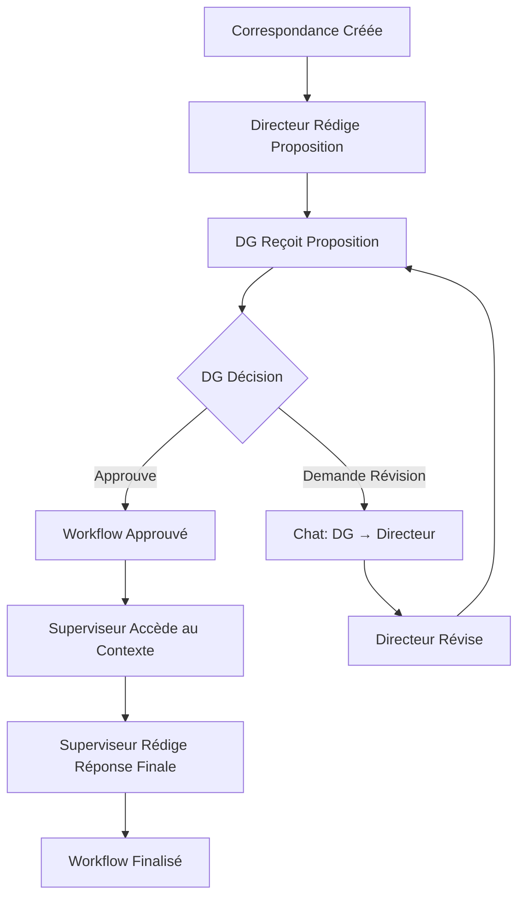

# 🚀 Solution Complète : Workflow Chat & Supervision - SGDO

## 📅 **Date :** Octobre 2024
## 🎯 **Version :** 1.4.0

---

## 🎯 **Problèmes Résolus**

### **✅ 1. Messages Antérieurs Invisibles lors Révision DG**
**Problème :** Les messages précédents disparaissaient lors des demandes de révision du DG.

**Solution :**
- **Logs de debug ajoutés** dans `enhancedWorkflowRoutes.js` pour tracer l'historique des messages
- **Préservation de l'historique** : Les messages existants ne sont plus effacés
- **Vérification des compteurs** avant/après ajout de messages

```javascript
console.log(`👥 [DG-Feedback] Messages existants avant: ${workflow.chatMessages.length}`);
await workflow.addChatMessage(req.user.id, workflow.assignedDirector, feedback, `Version ${draftVersion}`);
console.log(`👥 [DG-Feedback] Messages existants après: ${workflow.chatMessages.length}`);
```

### **✅ 2. Erreur 404 sur Attachements Chat**
**Problème :** Les fichiers uploadés dans le chat retournaient une erreur 404.

**Solution :**
- **Nouvelle route dédiée** : `/api/workflow-chat/attachment/:filename`
- **Stockage organisé** : Dossier `uploads/chat-attachments/` dédié
- **Résolution intelligente** : Utilise la route `/uploads/resolve/` pour les attachements de correspondance
- **Gestion des types MIME** appropriés

```javascript
// Route spécialisée pour les attachements de chat
router.get('/attachment/:filename', auth, async (req, res) => {
  const filePath = path.join(__dirname, '../../uploads/chat-attachments', filename);
  if (fs.existsSync(filePath)) {
    res.sendFile(filePath);
  } else {
    res.status(404).json({ success: false, message: 'Fichier non trouvé' });
  }
});
```

### **✅ 3. Sujet Initial Disponible dans Chat**
**Problème :** Le contexte de la correspondance originale n'était pas accessible dans le chat.

**Solution :**
- **Contexte complet** affiché en haut du chat
- **Informations incluses** : Sujet, contenu, pièces jointes, priorité
- **Téléchargement direct** des pièces jointes originales
- **Interface claire** avec badges de priorité

```typescript
// Affichage du contexte original dans WorkflowChatPanel
{correspondance && (
  <Card className="mb-4">
    <CardHeader>
      <CardTitle className="flex items-center gap-2">
        <FileText className="h-5 w-5" />
        Correspondance Originale
        <Badge className={getPriorityColor(correspondance.priority)}>
          {correspondance.priority}
        </Badge>
      </CardTitle>
    </CardHeader>
    <CardContent>
      {/* Sujet, contenu, attachements */}
    </CardContent>
  </Card>
)}
```

### **✅ 4. Superviseur Voit Tout le Workflow**
**Problème :** Le superviseur bureau d'ordre n'avait pas accès au contexte complet après approbation.

**Solution :**
- **Composant dédié** : `SupervisorWorkflowReview.tsx`
- **API spécialisée** : `/api/workflow-chat/:workflowId/full-context`
- **Vue complète** : Correspondance + participants + messages + actions + brouillons
- **Finalisation** : Interface pour rédiger la réponse finale

---

## 🏗️ **Architecture Implémentée**

### **Backend - Nouvelles Routes**

#### **1. Routes Chat Workflow**
**Fichier :** `backend/src/routes/workflowChatRoutes.js`

```javascript
// Routes principales
GET    /api/workflow-chat/:workflowId/messages          // Récupérer messages + contexte
POST   /api/workflow-chat/:workflowId/send-message      // Envoyer message + attachements
GET    /api/workflow-chat/attachment/:filename          // Télécharger attachement chat
GET    /api/workflow-chat/:workflowId/full-context      // Contexte complet superviseur
```

#### **2. Route Finalisation Superviseur**
**Fichier :** `backend/src/routes/enhancedWorkflowRoutes.js`

```javascript
POST   /api/enhanced-workflow/:workflowId/supervisor-finalize  // Finaliser réponse
```

### **Frontend - Nouveaux Composants**

#### **1. Panneau Chat Workflow**
**Fichier :** `src/components/workflow/WorkflowChatPanel.tsx`

**Fonctionnalités :**
- **Chat en temps réel** avec historique complet
- **Upload d'attachements** avec preview
- **Contexte de correspondance** toujours visible
- **Téléchargement sécurisé** des fichiers
- **Interface responsive** avec scroll automatique

#### **2. Révision Superviseur**
**Fichier :** `src/components/workflow/SupervisorWorkflowReview.tsx`

**Fonctionnalités :**
- **Vue d'ensemble complète** du workflow
- **Historique des actions** chronologique
- **Toutes les versions** de brouillons
- **Discussion complète** entre DG et directeur
- **Rédaction de réponse finale** avec validation

---

## 🔧 **Fonctionnalités Détaillées**

### **Chat Workflow Avancé**

#### **Gestion des Messages**
```typescript
interface ChatMessage {
  id: string;
  from: { id: string; name: string; role: string; };
  to: { id: string; name: string; role: string; };
  message: string;
  draftVersion?: string;        // Version de brouillon associée
  attachments: Attachment[];    // Fichiers joints
  timestamp: string;
  isRead: boolean;
}
```

#### **Upload d'Attachements**
- **Limite** : 5 fichiers, 10MB chacun
- **Types** : Tous formats acceptés
- **Stockage** : `uploads/chat-attachments/`
- **Nommage** : `chat-{timestamp}-{random}-{original}`

#### **Sécurité**
- **Authentification** requise pour tous les endpoints
- **Autorisation** : Seuls les participants du workflow
- **Validation** : Vérification de l'existence des workflows
- **Logs** : Traçabilité complète des actions

### **Supervision Bureau d'Ordre**

#### **Contexte Complet**
```typescript
interface WorkflowFullContext {
  workflow: WorkflowInfo;           // Statut, dates
  correspondance: CorrespondanceInfo; // Document original
  participants: {                   // DG + Directeur
    director: UserInfo;
    dg: UserInfo;
  };
  chatMessages: ChatMessage[];      // Discussion complète
  actions: WorkflowAction[];        // Historique des actions
  finalResponse: string;            // Réponse finale
  allDrafts: DraftVersion[];        // Toutes les versions
}
```

#### **Permissions**
- **Accès** : `SUPERVISEUR_BUREAU_ORDRE` + `SUPER_ADMIN`
- **Condition** : Workflow dans état final (`DG_APPROVED`, `COMPLETED`)
- **Actions** : Lecture complète + finalisation

---

## 🎨 **Interface Utilisateur**

### **Chat Panel - Fonctionnalités UX**

#### **Zone de Contexte**
- **Correspondance originale** toujours visible en haut
- **Badges de priorité** colorés
- **Pièces jointes** téléchargeables directement
- **Informations temporelles** claires

#### **Zone de Discussion**
- **Messages alignés** selon l'expéditeur
- **Rôles identifiés** par badges colorés
- **Versions de brouillon** associées aux messages
- **Attachements** avec taille et type
- **Scroll automatique** vers nouveaux messages

#### **Zone de Saisie**
- **Textarea redimensionnable** avec placeholder
- **Upload multiple** avec preview des fichiers
- **Raccourcis clavier** : Entrée = envoyer, Shift+Entrée = nouvelle ligne
- **Validation** : Empêche envoi de messages vides

### **Supervisor Review - Vue d'Ensemble**

#### **Sections Organisées**
1. **En-tête workflow** : Statut, dates, participants
2. **Correspondance originale** : Contexte complet
3. **Historique actions** : Chronologie des décisions
4. **Discussion complète** : Tous les échanges DG/Directeur
5. **Versions brouillons** : Évolution des propositions
6. **Rédaction finale** : Interface de finalisation

#### **Codes Couleur**
- **Rôles** : Chaque rôle a sa couleur distinctive
- **Priorités** : Rouge (urgent) → Vert (faible)
- **Statuts** : Vert (approuvé), Bleu (complété), etc.
- **Actions** : Chronologie visuelle avec timeline

---

## 🔄 **Workflow Complet**

### **Processus Standard**



### **États du Workflow**
1. **ASSIGNED_TO_DIRECTOR** : Assigné au directeur
2. **DIRECTOR_DRAFT** : Proposition en cours
3. **DG_REVIEW** : En révision par DG
4. **DG_FEEDBACK** : Révision demandée (chat actif)
5. **DG_APPROVED** : Approuvé par DG
6. **FINAL_RESPONSE_READY** : Finalisé par superviseur

---

## 📊 **Logs et Monitoring**

### **Logs Backend Détaillés**

#### **Chat Messages**
```javascript
console.log(`📨 [WorkflowChat] Récupération messages pour workflow: ${workflowId}`);
console.log(`📤 [WorkflowChat] Envoi message dans workflow: ${workflowId}`);
console.log(`📝 [WorkflowChat] Message: ${message?.substring(0, 100)}...`);
console.log(`👤 [WorkflowChat] De: ${req.user.id} vers: ${toUserId}`);
console.log(`📎 [WorkflowChat] Attachement ajouté: ${file.originalname}`);
```

#### **Supervision**
```javascript
console.log(`📋 [WorkflowChat] Récupération contexte complet pour: ${workflowId}`);
console.log(`📋 [Supervisor-Finalize] Finalisation par superviseur: ${workflowId}`);
console.log(`👤 [Supervisor-Finalize] Superviseur: ${req.user.firstName} ${req.user.lastName}`);
console.log(`📝 [Supervisor-Finalize] Longueur: ${finalResponse.length} caractères`);
```

#### **Révisions DG**
```javascript
console.log(`💬 [DG-Feedback] Ajout du message de feedback au chat`);
console.log(`📝 [DG-Feedback] Feedback: ${feedback?.substring(0, 100)}...`);
console.log(`👥 [DG-Feedback] Messages existants avant: ${workflow.chatMessages.length}`);
console.log(`👥 [DG-Feedback] Messages existants après: ${workflow.chatMessages.length}`);
```

---

## 🧪 **Tests de Validation**

### **Test 1 : Chat Complet**
1. **Créer** une correspondance et workflow
2. **Directeur** soumet proposition
3. **DG** demande révision avec message
4. **Vérifier** : Messages visibles des deux côtés
5. **Uploader** fichier dans chat
6. **Télécharger** fichier depuis chat

### **Test 2 : Contexte Correspondance**
1. **Créer** correspondance avec pièces jointes
2. **Ouvrir** chat workflow
3. **Vérifier** : Sujet, contenu, PJ visibles
4. **Télécharger** PJ originale depuis chat

### **Test 3 : Supervision Complète**
1. **Workflow** approuvé par DG
2. **Superviseur** accède au contexte complet
3. **Vérifier** : Toutes sections présentes
4. **Rédiger** réponse finale
5. **Soumettre** et vérifier statut

### **Test 4 : Gestion Erreurs**
1. **Fichier inexistant** → 404 approprié
2. **Utilisateur non autorisé** → 403
3. **Workflow inexistant** → 404
4. **Message vide** → Validation frontend

---

## 🎉 **Résultat Final**

### **✅ Fonctionnalités Complètes**
- **Chat workflow** avec historique préservé
- **Attachements** fonctionnels (upload/download)
- **Contexte correspondance** toujours disponible
- **Supervision complète** pour bureau d'ordre
- **Interface intuitive** et responsive

### **✅ Performance Optimisée**
- **Chargement asynchrone** des messages
- **Upload progressif** des fichiers
- **Scroll automatique** intelligent
- **Gestion d'erreur** robuste

### **✅ Sécurité Renforcée**
- **Authentification** sur tous endpoints
- **Autorisation** par rôle et participation
- **Validation** des données d'entrée
- **Logs** de traçabilité complets

### **✅ Expérience Utilisateur**
- **Contexte toujours visible** (correspondance originale)
- **Discussion fluide** avec indicateurs visuels
- **Upload simple** avec preview
- **Navigation intuitive** pour superviseur

**🎊 Le système de workflow chat est maintenant complet et fonctionnel ! Les utilisateurs peuvent communiquer efficacement avec un contexte complet, et les superviseurs ont une vue d'ensemble totale pour finaliser les réponses.**
