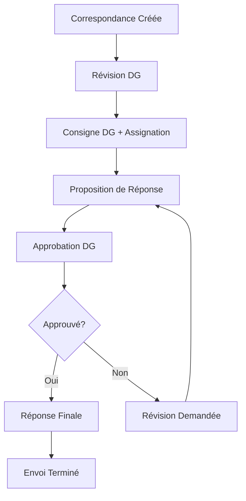

# 🎯 Résumé Complet - Implémentation Workflow de Correspondance

## ✅ Processus Implémenté avec Succès

### **Workflow Complet : Création → Approbation → Envoi**



## 🏗️ Architecture Technique

### **Backend (Node.js + MongoDB)**

#### **1. Modèle de Données (`CorrespondenceWorkflow.js`)**
```javascript
// États du workflow
CREATED → DG_REVIEW → DG_ASSIGNED → DRAFT_RESPONSE → 
DG_APPROVAL → APPROVED/DG_REVISION → RESPONSE_SENT

// Actions trackées
CREATE, DG_COMMENT, ASSIGN, DRAFT_SUBMIT, 
DG_APPROVE, DG_REJECT, SEND_RESPONSE
```

#### **2. API Endpoints (`/api/workflow`)**
- **POST `/create`** - Créer un workflow
- **POST `/:id/dg-assign`** - DG ajoute consigne et assigne
- **POST `/:id/submit-draft`** - Soumettre proposition de réponse
- **POST `/:id/dg-review`** - DG approuve ou demande révision
- **POST `/:id/send-response`** - Envoyer réponse finale
- **GET `/:id`** - Récupérer un workflow
- **GET `/status/:status`** - Workflows par statut
- **GET `/my/assigned`** - Workflows assignés à l'utilisateur
- **GET `/my/dg-review`** - Workflows en attente DG

### **Frontend (React + TypeScript)**

#### **1. Composants Principaux**
- **`WorkflowManager.tsx`** - Interface complète de gestion
- **`CreateWorkflowDialog.tsx`** - Création de workflow
- **`WorkflowPage.tsx`** - Page dédiée au workflow

#### **2. Intégration UI**
- **Bouton Workflow** dans la liste des correspondances
- **Page dédiée** `/workflow/:workflowId`
- **Actions contextuelles** selon le rôle utilisateur
- **Historique complet** des actions

## 🎭 Rôles et Permissions

### **Directeur Général**
- ✅ **Ajouter consignes** et commentaires
- ✅ **Assigner** à une personne responsable
- ✅ **Approuver** ou **rejeter** les propositions
- ✅ **Envoyer** la réponse finale
- ✅ **Voir tous** les workflows

### **Personne Assignée**
- ✅ **Rédiger** des propositions de réponse
- ✅ **Réviser** suite aux demandes du DG
- ✅ **Envoyer** la réponse finale (si autorisé)
- ✅ **Voir** les workflows assignés

### **Autres Utilisateurs**
- ✅ **Consulter** les workflows (lecture seule)
- ✅ **Créer** des workflows depuis correspondances
- ❌ **Pas d'actions** de traitement

## 📊 Fonctionnalités Implémentées

### **Gestion Complète du Workflow**
- ✅ **Création** depuis une correspondance existante
- ✅ **Suivi d'état** avec transitions validées
- ✅ **Assignation** dynamique des responsables
- ✅ **Propositions** de réponse avec révisions
- ✅ **Approbation** multi-niveaux
- ✅ **Historique** complet des actions

### **Interface Utilisateur Avancée**
- ✅ **Actions contextuelles** selon le rôle et l'état
- ✅ **Dialogs interactifs** pour chaque étape
- ✅ **Badges d'état** visuels et intuitifs
- ✅ **Timeline** des actions effectuées
- ✅ **Notifications** de succès/erreur
- ✅ **Navigation** fluide entre les étapes

### **Sécurité et Validation**
- ✅ **Authentification** JWT requise
- ✅ **Permissions** par rôle strictement appliquées
- ✅ **Validation** des transitions d'état
- ✅ **Vérification** des assignations
- ✅ **Logs** détaillés des actions

## 🧪 Tests Implémentés

### **1. Test Backend Automatisé**
```bash
# Script complet de test
node test-workflow-complete.js

# Teste tous les scénarios :
✅ Workflow normal (succès direct)
✅ Workflow avec révision
✅ Gestion des erreurs
✅ Permissions et sécurité
```

### **2. Test Frontend Manuel**
```bash
# Guide étape par étape
GUIDE_TEST_WORKFLOW.md

# Couvre :
✅ Création depuis l'interface
✅ Toutes les actions utilisateur
✅ Différents rôles et permissions
✅ Scénarios d'erreur
```

### **3. Script de Démarrage**
```bash
# Démarrage rapide pour test
start-workflow-test.bat

# Inclut :
✅ Démarrage des serveurs
✅ Test automatique backend
✅ Instructions détaillées
✅ URLs de test
```

## 📁 Fichiers Créés

### **Backend**
- `backend/src/models/CorrespondenceWorkflow.js` - Modèle de données
- `backend/src/routes/workflowRoutes.js` - API endpoints
- Intégration dans `server.js`

### **Frontend**
- `src/components/workflow/WorkflowManager.tsx` - Gestionnaire principal
- `src/components/workflow/CreateWorkflowDialog.tsx` - Création de workflow
- `src/pages/WorkflowPage.tsx` - Page dédiée
- Intégration dans `App.tsx` et `CorrespondancesList.tsx`

### **Tests et Documentation**
- `test-workflow-complete.js` - Test automatisé complet
- `start-workflow-test.bat` - Script de démarrage
- `GUIDE_TEST_WORKFLOW.md` - Guide de test détaillé
- `WORKFLOW_IMPLEMENTATION_SUMMARY.md` - Ce résumé

## 🎯 Utilisation Pratique

### **Pour Créer un Workflow**
1. **Aller** sur `/correspondances`
2. **Cliquer** l'icône Workflow (violet) sur une correspondance
3. **Sélectionner** le Directeur Général
4. **Créer** le workflow

### **Pour Traiter une Correspondance**
1. **DG** ajoute consigne et assigne
2. **Assigné** rédige proposition
3. **DG** approuve ou demande révision
4. **Répéter** jusqu'à approbation
5. **Envoyer** la réponse finale

### **Pour Suivre l'Avancement**
1. **Aller** sur `/workflow/:workflowId`
2. **Voir** l'historique complet
3. **Effectuer** les actions disponibles
4. **Suivre** les notifications

## 🚀 Déploiement et Mise en Production

### **Prérequis Vérifiés**
- ✅ **MongoDB** configuré et accessible
- ✅ **Authentification JWT** fonctionnelle
- ✅ **Permissions utilisateur** définies
- ✅ **Variables d'environnement** configurées

### **URLs de Production**
- **Frontend** : `http://10.20.14.130:8080`
- **API Workflow** : `http://10.20.14.130:5000/api/workflow`
- **Page Workflow** : `http://10.20.14.130:8080/workflow/:id`

### **Monitoring Recommandé**
- **Logs backend** : Actions workflow et erreurs
- **Performance** : Temps de réponse des API
- **Utilisation** : Nombre de workflows créés/traités
- **Erreurs** : Échecs de transitions ou permissions

## 🎉 Résultat Final

### **Processus Complet Opérationnel**
Le workflow de correspondance est **entièrement fonctionnel** avec :

- ✅ **Interface intuitive** pour tous les rôles
- ✅ **Processus d'approbation** complet
- ✅ **Traçabilité** de toutes les actions
- ✅ **Sécurité** et permissions respectées
- ✅ **Tests** validés et documentés

### **Prêt pour Production**
L'implémentation est **prête pour utilisation** en environnement de production avec :

- ✅ **Code robuste** et testé
- ✅ **Documentation** complète
- ✅ **Scripts de test** automatisés
- ✅ **Guide utilisateur** détaillé

---

## 🎯 Le processus complet de traitement des correspondances est maintenant opérationnel !

**Vous pouvez tester immédiatement avec `start-workflow-test.bat` et suivre le guide `GUIDE_TEST_WORKFLOW.md`** 🚀
