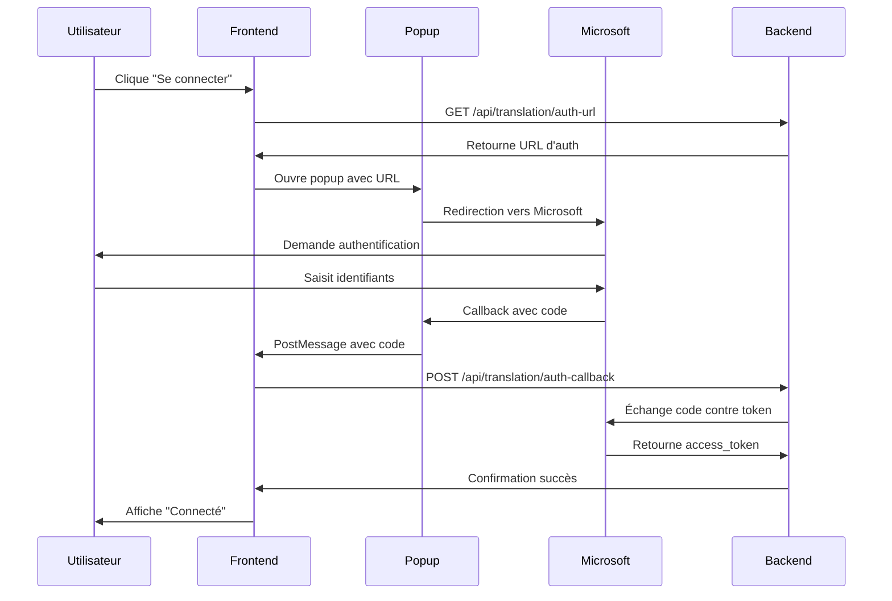

# 🤖 Configuration Microsoft Copilot pour SGDO

## 📋 **Vue d'Ensemble**

Cette fonctionnalité permet d'intégrer Microsoft Copilot dans le dialogue de création des correspondances pour offrir une traduction intelligente et contextuelle des textes.

## 🔧 **Configuration Office 365**

### **1. Création de l'Application Azure AD**

#### **📱 Étapes dans le Portail Azure**
1. **Connectez-vous** au [Portail Azure](https://portal.azure.com)
2. **Accédez** à "Azure Active Directory" → "Inscriptions d'applications"
3. **Cliquez** sur "Nouvelle inscription"
4. **Remplissez** les informations :
   - **Nom** : `SGDO Copilot Integration`
   - **Types de comptes pris en charge** : `Comptes dans cet annuaire organisationnel uniquement`
   - **URI de redirection** : `Web` → `http://localhost:3000/auth/callback`

#### **🔑 Récupération des Identifiants**
Après création, notez :
- **ID d'application (client)** : `xxxxxxxx-xxxx-xxxx-xxxx-xxxxxxxxxxxx`
- **ID de l'annuaire (locataire)** : `xxxxxxxx-xxxx-xxxx-xxxx-xxxxxxxxxxxx`

#### **🔐 Création du Secret Client**
1. **Allez** dans "Certificats et secrets"
2. **Cliquez** sur "Nouveau secret client"
3. **Ajoutez** une description : `SGDO Copilot Secret`
4. **Choisissez** une expiration : `24 mois`
5. **Copiez** la valeur du secret (une seule fois !)

### **2. Configuration des Permissions API**

#### **📋 Permissions Requises**
1. **Allez** dans "Autorisations de l'API"
2. **Ajoutez** les permissions suivantes :

| API | Permission | Type | Description |
|-----|------------|------|-------------|
| Microsoft Graph | `User.Read` | Déléguée | Lire le profil utilisateur |
| Microsoft Graph | `Copilot.ReadWrite` | Déléguée | Accès à Copilot (si disponible) |
| Microsoft Graph | `Mail.Read` | Déléguée | Lire les emails (optionnel) |

#### **✅ Accorder le Consentement**
1. **Cliquez** sur "Accorder le consentement administrateur pour [Votre Organisation]"
2. **Confirmez** l'autorisation

### **3. Configuration des URI de Redirection**

#### **🌐 URLs à Ajouter**
```
# Développement
http://localhost:3000/auth/callback

# Production
https://votre-domaine.com/auth/callback
https://sgdo.votre-domaine.com/auth/callback
```

## ⚙️ **Configuration Backend**

### **📝 Variables d'Environnement**
Ajoutez dans votre fichier `backend/.env` :

```env
# Configuration Microsoft Copilot / Office 365
OFFICE365_CLIENT_ID=xxxxxxxx-xxxx-xxxx-xxxx-xxxxxxxxxxxx
OFFICE365_CLIENT_SECRET=votre-secret-client-ici
OFFICE365_TENANT_ID=xxxxxxxx-xxxx-xxxx-xxxx-xxxxxxxxxxxx
OFFICE365_REDIRECT_URI=http://localhost:3000/auth/callback

# URL du frontend (pour les redirections)
FRONTEND_BASE_URL=http://localhost:3000
```

### **🔒 Sécurité des Secrets**
```bash
# Ne jamais commiter les secrets !
echo "backend/.env" >> .gitignore

# Utiliser des variables d'environnement en production
export OFFICE365_CLIENT_SECRET="votre-secret-ici"
```

## 🎯 **Configuration Frontend**

### **📄 Route de Callback**
Ajoutez la route dans votre routeur React :

```typescript
// Dans votre App.tsx ou router
import AuthCallback from '@/pages/AuthCallback';

// Route à ajouter
<Route path="/auth/callback" component={AuthCallback} />
```

### **🔧 Configuration du Hook**
Le hook `useTranslation` est automatiquement configuré et utilise les APIs backend.

## 🧪 **Test de Configuration**

### **📋 Script de Test Backend**
```bash
cd backend
node -e "
const service = require('./src/services/microsoftCopilotService');
console.log('Service configuré:', service.isConfigured);
console.log('URL d\'auth:', service.getAuthUrl());
"
```

### **🌐 Test Frontend**
1. **Ouvrez** le dialogue de création de correspondance
2. **Saisissez** du texte dans le champ "Contenu"
3. **Vérifiez** que le panneau de traduction apparaît
4. **Cliquez** sur "Se connecter à Office 365"
5. **Testez** l'authentification

## 🔄 **Workflow d'Authentification**

### **📱 Côté Utilisateur**


### **🔐 Gestion des Tokens**
- **Access Token** : Stocké en mémoire côté backend
- **Refresh Token** : Utilisé automatiquement pour renouveler
- **Expiration** : Gestion automatique avec rafraîchissement

## 🌍 **Langues Supportées**

### **📋 Liste Complète**
```javascript
const supportedLanguages = {
  'fr': 'Français',
  'en': 'English',
  'ar': 'العربية (Arabe)',
  'es': 'Español',
  'it': 'Italiano',
  'de': 'Deutsch',
  'pt': 'Português',
  'ru': 'Русский',
  'zh': '中文 (Chinois)',
  'ja': '日本語 (Japonais)',
  'ko': '한국어 (Coréen)',
  'tr': 'Türkçe',
  'nl': 'Nederlands',
  'sv': 'Svenska',
  'da': 'Dansk',
  'no': 'Norsk',
  'fi': 'Suomi'
};
```

## 🎨 **Interface Utilisateur**

### **🔧 Fonctionnalités du Panneau**
- **✅ Détection automatique de langue**
- **🔄 Inversion des langues source/cible**
- **📋 Copie du texte traduit**
- **✏️ Édition du texte traduit**
- **🎯 Application directe au formulaire**
- **🔗 Statut de connexion en temps réel**

### **🎯 États d'Affichage**
1. **Non configuré** : Message d'erreur avec contact admin
2. **Déconnecté** : Bouton de connexion Office 365
3. **Connecté** : Interface complète de traduction
4. **En cours** : Indicateurs de chargement

## 🛠️ **Dépannage**

### **❌ Erreurs Courantes**

#### **"Configuration Office 365 manquante"**
- Vérifiez les variables d'environnement
- Redémarrez le serveur backend
- Vérifiez les logs de démarrage

#### **"Erreur d'authentification"**
- Vérifiez l'ID client et le secret
- Contrôlez l'URI de redirection
- Vérifiez les permissions API

#### **"Token expiré"**
- Le refresh est automatique
- Reconnectez-vous si nécessaire
- Vérifiez les logs backend

#### **"Service Copilot indisponible"**
- Fallback automatique vers traduction basique
- Vérifiez la connectivité Microsoft
- Contrôlez les quotas API

### **🔍 Logs de Debug**
```bash
# Backend
tail -f backend/logs/translation.log

# Ou dans la console
DEBUG=translation:* npm run dev
```

### **📊 Monitoring**
```javascript
// Vérifier le statut
fetch('/api/translation/status')
  .then(r => r.json())
  .then(console.log);

// Tester une traduction
fetch('/api/translation/translate', {
  method: 'POST',
  headers: { 'Content-Type': 'application/json' },
  body: JSON.stringify({
    text: 'Bonjour le monde',
    targetLanguage: 'en'
  })
}).then(r => r.json()).then(console.log);
```

## 🚀 **Déploiement Production**

### **🌐 Variables d'Environnement**
```env
# Production
OFFICE365_CLIENT_ID=prod-client-id
OFFICE365_CLIENT_SECRET=prod-secret
OFFICE365_TENANT_ID=prod-tenant-id
OFFICE365_REDIRECT_URI=https://sgdo.votredomaine.com/auth/callback
FRONTEND_BASE_URL=https://sgdo.votredomaine.com
```

### **🔒 Sécurité Production**
- **HTTPS obligatoire** pour les redirections
- **Secrets dans des variables d'environnement**
- **Rotation régulière des secrets**
- **Monitoring des quotas API**

### **📈 Performance**
- **Cache des tokens** : Évite les appels répétés
- **Fallback rapide** : Si Copilot indisponible
- **Timeout configuré** : 30 secondes max par traduction

## 📞 **Support**

### **🆘 Ressources**
- **Documentation Microsoft** : [Graph API](https://docs.microsoft.com/graph/)
- **Copilot API** : [Documentation officielle](https://docs.microsoft.com/copilot/)
- **Azure AD** : [Guide d'inscription d'app](https://docs.microsoft.com/azure/active-directory/)

### **🐛 Signaler un Problème**
1. **Collectez** les logs d'erreur
2. **Notez** la configuration utilisée
3. **Décrivez** les étapes de reproduction
4. **Contactez** l'équipe de développement

---

**🎉 Une fois configuré, vos utilisateurs pourront traduire leurs correspondances directement dans l'interface SGDO avec la puissance de Microsoft Copilot !**
